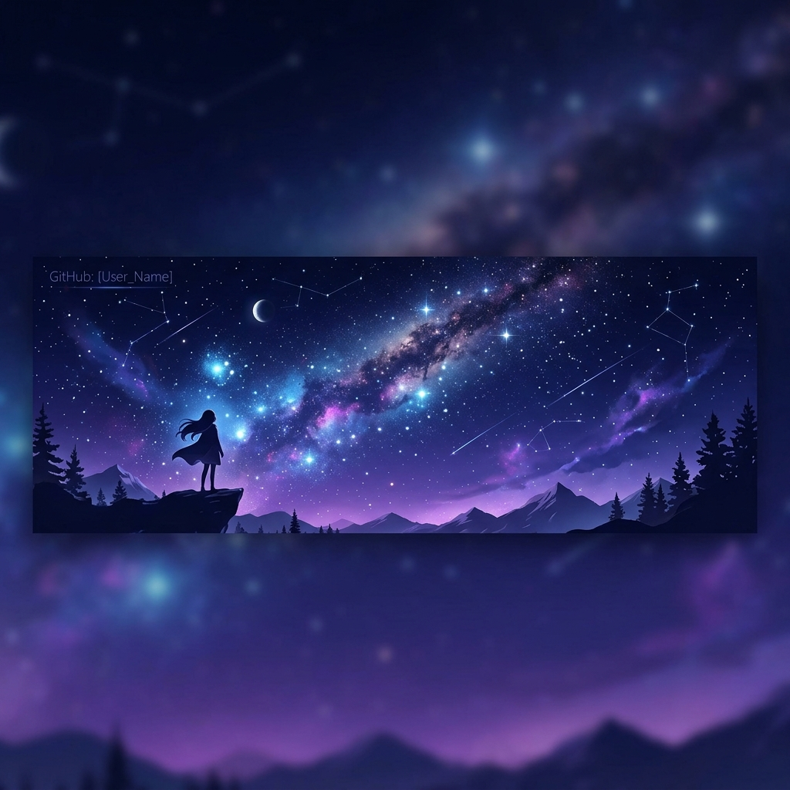

# 🌌 Welcome to My Cozy Digital Garden

  

 

> *“A quiet space in the digital void where code, aesthetic structures, and late-night reflections intertwine.”*

---

### 🌙 About Me

I am a creator and digital explorer focused on building immersive, cozy, and highly customized experiences. My work spans theme development, interactive guides, and experiments with language models.

- **Aesthetics & Atmosphere**: Designing cozy, atmospheric spaces, compiling midnight playlists, and crafting dark-themed interface designs.
- **Obsidian & Customization**: Creator of the [Frozen Kingdom](https://github.com/Sto3IV/obsidian-fancy-a-story-frozen) theme. I love organizing information using semantic vaults.
- **AI & Language Models**: Experimenting with local LLM samplers, SillyTavern configurations, and engineering precise behavioral prompts.
- **Japanese Studies**: Learning the Japanese language (currently study of Hiragana, Katakana, and Genki) and immersing myself in its clean, structured aesthetics.
- **Gaming & Interactive Media**: Writing detailed, immersive walkthroughs (such as the [Medusa Quests](https://github.com/Sto3IV/Medusa_Quests_eng) Elden Ring guide) and exploring titles like Stalker 2 and Mass Effect.
- **Audio & Sound**: Audio extraction, music editing, and creating cozy ambient soundscapes.

---

### 🔮 My Tools & Languages

  <!-- Languages -->
  
  
  
  
  &nbsp;&nbsp;|&nbsp;&nbsp;
  <!-- Tools -->
  
  
  

---

### 📊 GitHub Sanctuary Statistics

  <table border="0" cellpadding="0" cellspacing="0">
    <tr>
      <td valign="top" width="50%">
        
      </td>
      <td valign="top" width="50%">
        
      </td>
    </tr>
  </table>

 

---

  

