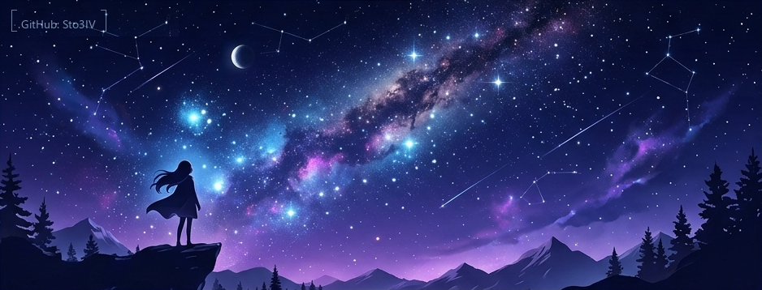

# 🌌 Welcome to My Cozy Digital Garden

<div align="center">
  
</div>

<br/>

> *“A quiet space in the digital void where code, aesthetic structures, and late-night reflections intertwine.”*

---

### 🌙 About Me

I am a creator and digital explorer focused on building immersive, cozy, and highly customized experiences. My work spans theme development, interactive guides, and experiments with language models.

- **Aesthetics & Atmosphere**: Designing cozy, atmospheric spaces, compiling midnight playlists, and crafting dark-themed interface designs.
- **Obsidian & Customization**: Creator of the [Frozen Kingdom](https://github.com/Sto3IV/obsidian-fancy-a-story-frozen) theme. I love organizing information using semantic vaults.
- **AI & Language Models**: Experimenting with local LLM samplers, SillyTavern configurations, and engineering precise behavioral prompts.
- **Japanese Studies**: Learning the Japanese language (currently study of Hiragana, Katakana, and Genki) and immersing myself in its clean, structured aesthetics.
- **Gaming & Interactive Media**: Writing detailed, immersive walkthroughs (such as the [Medusa Quests](https://github.com/Sto3IV/Medusa_Quests_eng) Elden Ring guide) and exploring titles like Stalker 2 and Mass Effect.
- **Audio & Sound**: Audio extraction, music editing, and creating cozy ambient soundscapes.

---

### 🔮 My Tools & Languages

<div align="left">
  <!-- Languages -->
  
  
  
  
  &nbsp;&nbsp;|&nbsp;&nbsp;
  <!-- Tools -->
  
  
  
</div>

---

### ✉️ A Celestial Transmission

```text
  .--------------------------------------------------------.
  | +** *+.**.. *   . .    * **.   ******** ***      ***+  |
  |  * * **      * *  * *  *.   *   .*     ** ***  .* *+   |
  |. *       +++   .   .* **  * .  ** .       *  * . .    |
  |.  *      *+ **. * .* * ****  *** + *  ***   +  *. *    |
  |  .* . .+  *           *            *      .    . *    |
  |  *   .++*.   ** *     * *  * *.        *  * *    *  .  |
  |          .  +   **     *     *.   *     .       .+    |
  |________________________________________________________|
  |              |\      _,,,---,,_                        |
  |        Zzz   /,`.-'`'    -.  ;-;;,_                    |
  |             |,4-  ) )-,_..;\ (  `'-'                   |
  |            '------------------------'                  |
  '--------------------------------------------------------'
```

<br/>

---

<div align="center">
  <a href="https://x.com/Sto3IV" target="_blank">
    
  </a>
</div>

